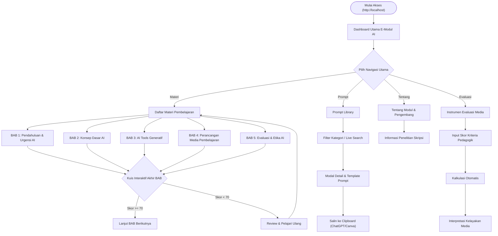
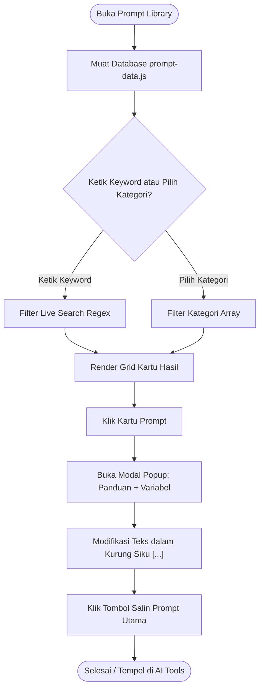

# PERANCANGAN SISTEM & ANTARMUKA (UI/UX) E-MODUL AI
**Dokumen Pendukung BAB III Skripsi (Metode Pengembangan R&D / ADDIE)**

---

## BAGIAN 1: FLOWCHART SISTEM (ALUR NAVIGASI & LOGIKA)

### 1. Flowchart Alur Navigasi Utama (Site Map)
Flowchart ini menggambarkan alur penjelajahan pengguna mulai dari mengakses aplikasi hingga memilih berbagai fitur utama e-modul.



---

### 2. Flowchart Alur Pembelajaran BAB & Kuis Interaktif
Flowchart di bawah menggambarkan siklus belajar kognitif yang dilalui oleh guru/siswa di dalam setiap bab materi pembelajaran.

```mermaid
graph TD
    A(["Masuk Halaman BAB"]) --> B["Baca Tujuan Pembelajaran BAB"]
    B --> C["Pelajari Uraian Materi & Visualisasi"]
    C --> D["Mulai Kuis Interaktif"]
    D --> E["Pilih Opsi Jawaban (Pilihan Ganda)"]
    
    E --> F{"Cek Kunci Jawaban"}
    F -->|Benar| G["Tampilkan Balikan Positif (+Poin)"]
    F -->|Salah| H["Tampilkan Koreksi & Penjelasan Jawaban"]
    
    G & H --> I{"Soal Terakhir?"}
    I -->|Belum| E
    I -->|Sudah| J["Rekapitulasi Nilai & Akurasi"]
    
    J --> K{"Skor >= 70% ?"}
    K -->|Ya (Tuntas)| L["Berikan Apresiasi / Buka Akses Lanjutan"]
    K -->|Tidak (Remidial)| M["Saran Peninjauan Kembali Bagian Sulit"]
```

---

### 3. Flowchart Alur Mesin Generator Prompt (Prompt Engine)
Flowchart logika penyaringan dan adaptasi template prompt bagi guru.



---

## BAGIAN 2: STORYBOARD MATRIKS LENGKAP DENGAN KETERANGAN TEKNIS & PEDAGOGIK

Storyboard matriks di bawah menyajikan dokumentasi perancangan antarmuka visual (*Low-Fidelity Wireframe*), spesifikasi konten instruksional, serta keterangan logika sistem untuk **8 layar/halaman utama** e-modul.

---

### SCREEN 1: DASHBOARD UTAMA (`index.html`)

#### A. Sketsa Wireframe Low-Fidelity:
```text
+-----------------------------------------------------------------------------+
|  [Logo Robot] E-Modul AI   (Dashboard)  Materi  Prompt  Evaluasi  Tentang   |
+-----------------------------------------------------------------------------+
|                                                                             |
|                           Eksplorasi E-Modul                                |
|        Pilih modul yang ingin Anda pelajari atau gunakan. Modul dirancang   |
|        agar saling melengkapi untuk pengalaman belajar yang komprehensif.   |
|                                                                             |
|   +-------------------------------+     +-------------------------------+   |
|   | [Icon Buku]                   |     | [Icon Tongkat Magic]          |   |
|   | Materi Pembelajaran           |     | Prompt Library                |   |
|   | Pelajari konsep dasar AI...   |     | Temukan ratusan template...   |   |
|   | Mulai Belajar ->              |     | Lihat Prompt ->               |   |
|   +-------------------------------+     +-------------------------------+   |
|                                                                             |
|   +-------------------------------+     +-------------------------------+   |
|   | [Icon Centang]                |     | [Icon Info]                   |   |
|   | Instrumen Evaluasi            |     | Tentang Modul                 |   |
|   | Uji kelayakan media AI Anda.. |     | Info penelitian skripsi...    |   |
|   | Mulai Evaluasi ->             |     | Baca Selengkapnya ->          |   |
|   +-------------------------------+     +-------------------------------+   |
|                                                                             |
|   ===================== CAPAIAN PEMBELAJARAN =====================          |
|   (1) Memahami Konsep   (2) Mengenal AI Tools   (3) Menyusun Prompt         |
|                                                                             |
|   ==================== PANDUAN CARA PENGGUNAAN ===================          |
|   [Langkah 1: Baca]   [Langkah 2: Salin]   [Langkah 3: Buat]   [Langkah 4]  |
|                                                                             |
|   +---------------------------------------------------------------------+   |
|   | [Banner Hitam] Siap Bertransformasi?   [ Tombol: Mulai Belajar ]    |   |
|   +---------------------------------------------------------------------+   |
+-----------------------------------------------------------------------------+
```

#### B. Keterangan Rinci Komponen & Interaksi Screen:
1. **Sticky Top Navbar**: Berisi identitas merek produk dan 5 tautan menu utama. Tetap menempel di bagian atas layar saat pengguna menggulir halaman ke bawah.
2. **Hero Greeting Section**: Berisi judul utama dan teks penyambutan untuk mengarahkan fokus pengguna.
3. **Grid 4 Kartu Modul Utama**: Kartu interaktif bergaya *Glassmorphism*. Saat kursor menyorot kartu (*Hover*), kartu terangkat ke atas 2px (`transform: translateY(-2px)`) dan bayangan membesar (*Shadow-md*).
4. **Capaian Pembelajaran (Learning Outcomes)**: Menyajikan 4 poin kompetensi akhir yang akan dikuasai guru setelah mempelajari e-modul ini.
5. **Panduan Penggunaan 4 Langkah**: Alur instruksional bernomor 1 sampai 4 untuk menuntun pengguna pemula.
6. **CTA Transformation Banner**: Kotak kontras berwarna gelap di bagian bawah sebelum footer, memuat tombol ajakan langsung memasuki materi.

#### C. Spesifikasi Konten Instruksional & Pedagogik:
- **Fungsi Pedagogik**: Berfungsi sebagai *Advance Organizer* (Ausubel), memberi gambaran kerangka berpikir sebelum masuk ke materi terperinci.
- **Prinsip UX**: *Hick’s Law* (Memecah kompleksitas sistem menjadi 4 pintu gerbang utama agar beban kognitif pengguna tetap ringan).

#### D. Alur Navigasi Screen:
- **Pintu Masuk**: Akses awal melalui URL `http://localhost/E-Modul Skripsi - V2/`.
- **Pintu Keluar**: Klik kartu/tombol menuju `materi.html`, `prompt.html`, `evaluasi.html`, atau `tentang.html`.

---

### SCREEN 2: DAFTAR MATERI PEMBELAJARAN (`materi.html`)

#### A. Sketsa Wireframe Low-Fidelity:
```text
+-----------------------------------------------------------------------------+
|  [Logo Robot] E-Modul AI    Dashboard  (Materi)  Prompt  Evaluasi  Tentang  |
+-----------------------------------------------------------------------------+
|  Dashboard > Materi Belajar                                                 |
|                                                                             |
|  Daftar Materi Pembelajaran                                                 |
|  Pilih bab yang ingin Anda pelajari. Disarankan mempelajari berurutan.      |
|                                                                             |
|  +-----------------------------------------------------------------------+  |
|  | [ BAB 1 ]  Pendahuluan & Urgensi AI bagi Guru             [ Pelajari ]|  |
|  | Membahas latar belakang transformasi digital dan peran guru...        |  |
|  +-----------------------------------------------------------------------+  |
|                                                                             |
|  +-----------------------------------------------------------------------+  |
|  | [ BAB 2 ]  Konsep Dasar Artificial Intelligence           [ Pelajari ]|  |
|  | Membahas cara kerja machine learning, NLP, dan generative AI...       |  |
|  +-----------------------------------------------------------------------+  |
|                                                                             |
|  +-----------------------------------------------------------------------+  |
|  | [ BAB 3 ]  AI Tools Generatif untuk Produksi Media        [ Pelajari ]|  |
|  | Praktik menggunakan ChatGPT, Canva AI, Midjourney, dan DALL-E...      |  |
|  +-----------------------------------------------------------------------+  |
|                                                                             |
|  +-----------------------------------------------------------------------+  |
|  | [ BAB 4 ]  Perancangan Media Pembelajaran Berbasis AI     [ Pelajari ]|  |
|  +-----------------------------------------------------------------------+  |
|                                                                             |
|  +-----------------------------------------------------------------------+  |
|  | [ BAB 5 ]  Evaluasi Kelayakan & Etika Penggunaan AI       [ Pelajari ]|  |
|  +-----------------------------------------------------------------------+  |
+-----------------------------------------------------------------------------+
```

#### B. Keterangan Rinci Komponen & Interaksi Screen:
1. **Breadcrumb Trail**: Tautan jejak hierarki direktori `Dashboard > Materi Belajar`.
2. **Header Judul & Saran Pedagogik**: Mengingatkan pengguna untuk membaca secara runut dari Bab 1 hingga Bab 5.
3. **Daftar Kartu Bab (Chapter Cards 1..5)**: Ditampilkan secara vertikal memanjang (*Stack layout*). Setiap kartu menampilkan badge nomor bab, judul materi, deskripsi singkat isi bab, dan tombol pemanggilan (*Call to Action*).

#### C. Spesifikasi Konten Instruksional & Pedagogik:
- **Fungsi Pedagogik**: Mengatur pentahapan materi instruksional (*Instructional Sequencing* / Reigeluth's Elaboration Theory) dari tingkat dasar ke tingkat implementasi kompleks.

#### D. Alur Navigasi Screen:
- **Pintu Masuk**: Dari Dashboard via klik menu/kartu Materi.
- **Pintu Keluar**: Klik tombol `[ Pelajari ]` menuju file `materi-bab1.html` sampai `materi-bab5.html`.

---

### SCREEN 3: URAIAN MATERI BAB (`materi-bab1.html` .. `bab5.html`)

#### A. Sketsa Wireframe Low-Fidelity:
```text
+-----------------------------------------------------------------------------+
|  [Logo Robot] E-Modul AI    Dashboard  (Materi)  Prompt  Evaluasi  Tentang  |
+-----------------------------------------------------------------------------+
|  Dashboard > Materi > BAB 1                                                 |
|                                                                             |
|  [ BAB 1 ]                                                                  |
|  Pendahuluan & Urgensi AI dalam Pendidikan                                  |
|                                                                             |
|  +-----------------------------------------------------------------------+  |
|  | [Icon Target] Tujuan Pembelajaran Bab Ini:                            |  |
|  | 1. Menjelaskan urgensi integrasi AI dalam ruang kelas.                |  |
|  | 2. Mengidentifikasi kelemahan metode pengajaran konvensional.         |  |
|  +-----------------------------------------------------------------------+  |
|                                                                             |
|  1.1 Latar Belakang Transformasi                                            |
|  Perkembangan teknologi kecerdasan buatan telah mengubah lanskap...         |
|                                                                             |
|  +-----------------------------------------------------------------------+  |
|  |                 [ ILUSTRASI / GAMBAR DIAGRAM KONSEP ]                 |  |
|  |                 Keterangan: Gambar 1.1 Diagram Urgensi AI             |  |
|  +-----------------------------------------------------------------------+  |
|                                                                             |
|  1.2 Peran Guru yang Tidak Tergantikan                                      |
|  Meskipun AI mampu menghasilkan konten dengan cepat, sentuhan empati...     |
|                                                                             |
|  ======================= KUIS INTERAKTIF AKHIR BAB =======================  |
|  (Lihat Screen 4 di bawah)                                                  |
|                                                                             |
|  +-----------------------------------------------------------------------+  |
|  | [<- Bab Sebelumnya]                              [Bab Selanjutnya ->] |  |
|  +-----------------------------------------------------------------------+  |
+-----------------------------------------------------------------------------+
```

#### B. Keterangan Rinci Komponen & Interaksi Screen:
1. **Kotak Sorotan Tujuan (Callout Target Box)**: Diberi latar biru pudar (`rgba(14,165,233,0.08)`) dengan border kiri tebal 4px biru solid agar fokus pengguna menangkap kompetensi sasaran sebelum membaca paragraf materi.
2. **Artikel Kolom Utama**: Ditulis dalam ukuran font 1.1rem dengan jarak baris (`line-height: 1.6`). Lebar maksimal kontainer dibatasi 800px (*Optimal Reading Measure*) guna mencegah kelelahan mata pengguna saat memindai teks panjang.
3. **Penyelipan Aset Gambar/Bagan**: Dilengkapi *Caption* di bawah gambar sesuai kaidah penulisan ilmiah Skripsi.
4. **Tombol Navigasi Footer BAB**: Tombol ganda di akhir artikel untuk maju ke bab berikutnya atau mundur ke bab sebelumnya.

#### C. Spesifikasi Konten Instruksional & Pedagogik:
- **Fungsi Pedagogik**: Penyajian materi inti berbasis *Multimodal Learning* (paduan narasi teks yang terstruktur dengan diagram visual penjelasan).

---

### SCREEN 4: KUIS INTERAKTIF AKHIR BAB (Bagian Bawah `materi-babX.html`)

#### A. Sketsa Wireframe Low-Fidelity:
```text
+-----------------------------------------------------------------------------+
|  ======================= KUIS INTERAKTIF AKHIR BAB =======================  |
|  Uji pemahaman Anda terhadap materi BAB 1. Pilih jawaban yang paling tepat. |
|                                                                             |
|  +-----------------------------------------------------------------------+  |
|  | Pertanyaan 1 dari 5:                                                  |  |
|  | Apa alasan utama guru perlu memanfaatkan AI dalam merancang media?    |  |
|  |                                                                       |  |
|  | ( ) A. Agar guru tidak perlu lagi datang mengajar ke sekolah          |  |
|  | (*) B. Meningkatkan efisiensi waktu & personalisasi belajar siswa     |  |
|  | ( ) C. Untuk menggantikan seluruh buku cetak di perpustakaan          |  |
|  | ( ) D. Sekadar mengikuti tren teknologi tanpa tujuan pedagogik        |  |
|  |                                                                       |  |
|  | [ Tombol: Cek Jawaban ]                                               |  |
|  +-----------------------------------------------------------------------+  |
|                                                                             |
|  +-- [PANEL BALIKAN SISTEM MUNCUL SAAT DI-KLIK] -------------------------+  |
|  | [v] JAWABAN ANDA BENAR! (+20 Poin)                                    |  |
|  | AI membantu guru menghemat waktu administrasi sehingga guru memiliki  |  |
|  | lebih banyak waktu untuk berinteraksi langsung dengan siswa.          |  |
|  +-----------------------------------------------------------------------+  |
|                                                                             |
|  [ Tombol: Lanjut Soal Berikutnya -> ]                                      |
+-----------------------------------------------------------------------------+
```

#### B. Keterangan Rinci Komponen & Interaksi Screen:
1. **Kotak Kontainer Kuis**: Berada di penghujung materi bab.
2. **Radio Button Opsi Jawaban**: Elemen interaktif `input[type="radio"]`. Saat diklik, opsi terpilih diberi bingkai biru pekat.
3. **Tombol Cek Jawaban**: Menjalankan skrip validasi jawaban.
4. **Panel Balikan Instan (Immediate Feedback Banner)**:
   - Jika jawaban benar: Muncul kotak hijau (`--color-success-light`) beserta balikan penguatan positif (*Positive Reinforcement*).
   - Jika jawaban salah: Muncul kotak merah (`--color-danger-light`) berisi koreksi dan penjelasan konsep yang benar.
5. **Tombol Transisi Soal**: Memuat soal nomor berikutnya (1/5 -> 2/5).

#### C. Spesifikasi Konten Instruksional & Pedagogik:
- **Fungsi Pedagogik**: Menerapkan teori *Formative Assessment & Immediate Feedback* (Thorndike's Law of Effect), di mana balikan instan memperkuat retensi memori jangka panjang siswa.

---

### SCREEN 5: GALERI KUMPULAN PROMPT AI (`prompt.html`)

#### A. Sketsa Wireframe Low-Fidelity:
```text
+-----------------------------------------------------------------------------+
|  [Logo Robot] E-Modul AI    Dashboard  Materi  (Prompt)  Evaluasi  Tentang  |
+-----------------------------------------------------------------------------+
|  Dashboard > Kumpulan Prompt                                                |
|                                                                             |
|                           Kumpulan Prompt AI                                |
|  Template instruksi siap pakai yang telah dioptimalkan untuk guru.          |
|                                                                             |
|  ( Semua )  [ Analisis Instruksional ]  [ Produksi Media ]  [ Evaluasi ]    |
|                                                                             |
|  +-----------------------------------------------------------------------+  |
|  | (Q) Cari prompt... (misal: soal, presentasi, silabus, rubrik)         |  |
|  +-----------------------------------------------------------------------+  |
|                                                                             |
|  +-----------------------+ +-----------------------+ +--------------------+ |
|  | [Badge: Analisis]     | | [Badge: Produksi]     | | [Badge: RPP]       | |
|  | Analisis Kebutuhan    | | Generator Slide PPT   | | Penyusun Modul Ajar| |
|  | Membantu guru mengid..| | Membuat struktur sli..| | Merancang draf bah | |
|  +-----------------------+ +-----------------------+ +--------------------+ |
|  +-----------------------+ +-----------------------+ +--------------------+ |
|  | [Badge: Soal]         | | [Badge: Rubrik]       | | [Badge: Game]      | |
|  | Generator Soal HOTS   | | Penyusun Rubrik Nilai | | Ide Kuis Interaktif| |
|  +-----------------------+ +-----------------------+ +--------------------+ |
+-----------------------------------------------------------------------------+
```

#### B. Keterangan Rinci Komponen & Interaksi Screen:
1. **Filter Kategori (Category Pills)**: Kumpulan tombol horizontal. Saat diklik, sistem memfilter array objek prompt secara instan tanpa memuat ulang halaman (*Client-side rendering*). Tombol terpilih berubah menjadi kapsul biru gelap solid.
2. **Live Search Bar**: Input pencarian cepat. Setiap kali tombol keyboard dilepas (`onkeyup`), skrip menjalankan pencarian *Regex* mencocokkan judul atau deskripsi prompt.
3. **Grid Kartu Prompt (3 Kolom)**: Kartu ringkasan. Menampilkan badge kategori warna-warni, judul prompt, dan cuplikan deskripsi 2 baris (`-webkit-line-clamp: 2`). Saat diklik, memicu pemanggilan Screen 6 (Modal Popup).

---

### SCREEN 6: POPUP MODAL DETAIL PROMPT (Overlay di dalam `prompt.html`)

#### A. Sketsa Wireframe Low-Fidelity:
```text
+-----------------------------------------------------------------------------+
|  [LATAR BELAKANG GELAP BLUR / BACKDROP-FILTER: BLUR(8PX)]                   |
|                                                                             |
|      +-----------------------------------------------------------------+    |
|      | Analisis Materi dan Struktur Konten                       [ X ] |    |
|      | Mengidentifikasi konsep inti, miskonsepsi, serta strategi...    |    |
|      | --------------------------------------------------------------- |    |
|      |                                                                 |    |
|      | [i] PANDUAN PENGGUNAAN                                          |    |
|      | Gunakan prompt ini saat Anda memiliki bahan ajar mentah...      |    |
|      |                                                                 |    |
|      | >_ PROMPT UTAMA (Klik Salin di bawah)                           |    |
|      | +-------------------------------------------------------------+ |    |
|      | | Saya adalah guru [mata pelajaran] kelas [kelas].            | |    |
|      | | Topik yang akan diajarkan: [topik]                          | |    |
|      | | Berikut materi yang digunakan: [tempel materi]              | |    |
|      | | Lakukan analisis dengan menghasilkan:                       | |    |
|      | | 1. Konsep inti...                                           | |    |
|      | +-------------------------------------------------------------+ |    |
|      |                                             [ Tombol: Salin ]   |    |
|      |                                                                 |    |
|      | [Contoh Input Data Anda]  ->  [Contoh Hasil dari AI]            |    |
|      +-----------------------------------------------------------------+    |
+-----------------------------------------------------------------------------+
```

#### B. Keterangan Rinci Komponen & Interaksi Screen:
1. **Backdrop Blur Overlay**: Lapisan semi-transparan hitam (`rgba(15,23,42,0.4)`) menutupi halaman belakang agar kognitif pengguna terisolasi sepenuhnya pada isi popup.
2. **Tombol Close [ X ]**: Menutup jendela modal (`closeModal()`).
3. **Blok Panduan Penggunaan**: Kotak biru muda memberi pengarahan konteks pemakaian prompt.
4. **Kotak Kode Prompt Utama**:
   - Teks instruksi ditampilkan dalam font *Monospace* pekat (`#0F172A`) di atas latar abu-abu terang (`#F1F5F9`).
   - Kata di dalam tanda kurung siku seperti `[mata pelajaran]` diubah secara otomatis oleh skrip menjadi tag *highlight* biru tebal agar guru tahu bagian mana yang wajib diganti.
5. **Tombol Salin Prompt**: Menggunakan API `navigator.clipboard.writeText()`. Saat diklik, label tombol berubah sementara menjadi *"Tersalin! [v]"* dengan latar hijau selama 2 detik.

#### C. Spesifikasi Konten Instruksional & Pedagogik:
- **Prinsip Pedagogik**: *Scaffolding Instruction* (Memberikan draf instruksi AI yang sudah teruji, sehingga guru tidak perlu memikirkan struktur rekayasa prompt dari nol).

---

### SCREEN 7: PENGISIAN INSTRUMEN EVALUASI MEDIA (`evaluasi.html`)

#### A. Sketsa Wireframe Low-Fidelity:
```text
+-----------------------------------------------------------------------------+
|  [Logo Robot] E-Modul AI    Dashboard  Materi  Prompt  (Evaluasi)  Tentang  |
+-----------------------------------------------------------------------------+
|  Dashboard > Evaluasi Media                                                 |
|                                                                             |
|                    Evaluasi Kelayakan Media AI                              |
|  Gunakan instrumen ini menilai apakah media AI Anda sudah memenuhi standar. |
|                                                                             |
|  [1. Dimensi Materi]  ----->  (2. Desain Visual)  ----->  (3. Pedagogik AI) |
|                                                                             |
|  +-----------------------------------------------------------------------+  |
|  | Dimensi 1: Kelayakan Isi & Struktur Materi                            |  |
|  |                                                                       |  |
|  | 1. Materi yang disajikan akurat dan bebas dari halusinasi/miskonsepsi |  |
|  |    +------------------------+       +-------------------------------+ |  |
|  |    | (o) Ya, Sangat Layak   |       | ( ) Tidak, Perlu Perbaikan    | |  |
|  |    +------------------------+       +-------------------------------+ |  |
|  |                                                                       |  |
|  | 2. Bahasa yang digunakan sesuai tingkat perkembangan kognitif siswa   |  |
|  |    +------------------------+       +-------------------------------+ |  |
|  |    | (o) Ya, Sangat Layak   |       | ( ) Tidak, Perlu Perbaikan    | |  |
|  |    +------------------------+       +-------------------------------+ |  |
|  +-----------------------------------------------------------------------+  |
|                                                                             |
|  [ Tombol: Selanjutnya (Ke Dimensi 2) -> ]                                  |
+-----------------------------------------------------------------------------+
```

#### B. Keterangan Rinci Komponen & Interaksi Screen:
1. **Progress Wizard Step Indicator**: Membagi total butir kriteria evaluasi yang panjang menjadi 3 tahap dimensi terpisah (*Dimensi Materi, Visual, Pedagogik*).
2. **Custom Radio Cards (Opsi Ya/Tidak)**: Elemen pilihan ganda bergaya kartu kotak. Saat pengguna mengklik `"Ya, Sangat Layak"`, kotak tersebut menyala dengan bingkai hijau solid dan latar hijau pudar (`--color-success-light`).
3. **Tombol Navigasi Step**: Berpindah maju atau mundur antar dimensi penilaian. Saat mengklik *"Selanjutnya"*, skrip secara otomatis menggulirkan layar kembali ke atas form.

#### C. Spesifikasi Konten Instruksional & Pedagogik:
- **Prinsip UX**: *Chunking Principle* (Miller's Law), membagi formulir survei panjang menjadi 3 potongan ringkas agar responden tidak mengalami kelelahan pengisian (*survey fatigue*).

---

### SCREEN 8: HASIL KALKULASI KELAYAKAN (Muncul di Tahap Akhir `evaluasi.html`)

#### A. Sketsa Wireframe Low-Fidelity:
```text
+-----------------------------------------------------------------------------+
|                         [ HITUNG SKOR KELAYAKAN ]                           |
|                                                                             |
|  +-- [KARTU HASIL INTERPRETASI MUNCUL DENGAN ANIMASI SCALE-UP] -----------+ |
|  |                                                                       | |
|  |       SKOR KELAYAKAN MEDIA ANDA:                                      | |
|  |                                                                       | |
|  |                      +-----------------+                              | |
|  |                      |     92 / 100    |                              | |
|  |                      +-----------------+                              | |
|  |                                                                       | |
|  |           STATUS KELAYAKAN: "SANGAT LAYAK DIGUNAKAN"                  | |
|  |                                                                       | |
|  |  Rekomendasi: Media pembelajaran AI yang Anda kembangkan telah        | |
|  |  memenuhi kaidah akurasi materi, prinsip desain visual, dan etika AI. | |
|  |                                                                       | |
|  |  [ Tombol: Cetak / Simpan Rekapitulasi ]      [ Ulangi Evaluasi ]     | |
|  +-----------------------------------------------------------------------+ |
+-----------------------------------------------------------------------------+
```

#### B. Keterangan Rinci Komponen & Interaksi Screen:
1. **Tombol Trigger Hitung Skor**: Di klik pada tahap akhir kriteria.
2. **Lingkaran/Kotak Skor Kelayakan Besar**: Menampilkan nilai kuantitatif hasil konversi rumus persentase: $\text{Skor} = (\frac{\text{Jumlah Jawaban Ya}}{\text{Total Pertanyaan}}) \times 100$.
3. **Klasifikasi Kualitatif Otomatis**:
   - $\ge 85\%$ : Sangat Layak (Warna Hijau)
   - $70\% - 84\%$ : Layak (Warna Biru)
   - $55\% - 69\%$ : Cukup Layak (Warna Kuning)
   - $< 55\%$ : Kurang Layak / Revisi (Warna Merah)

---

## BAGIAN 3: MATRIKS SPESIFIKASI TOMBOL & INTERAKSI NAVIGASI (UI BUTTON INVENTORY)
Matriks ini mendokumentasikan spesifikasi fungsional seluruh elemen aksi (*call-to-action*) pada setiap halaman web e-modul untuk panduan pengkodean dan pengujian sistem.

### 1. Tombol Navigasi Global (Terintegrasi di Seluruh Halaman)
| Nama Tombol | Label / Ikon | Event Trigger | Aksi / Output Fungsi | Balikan Visual UX |
|---|---|---|---|---|
| **Brand Logo** | `[Icon Robot] E-Modul AI` | `onclick` | Redirect ke `index.html` | Opacity turun sedikit saat di-klik |
| **Nav Dashboard** | `Dashboard` | `onclick` | Navigasi ke `index.html` | Underline biru / latar kapsul saat *active* |
| **Nav Materi** | `Materi Pembelajaran` | `onclick` | Navigasi ke `materi.html` | Underline biru saat *active* |
| **Nav Prompt** | `Prompt Library` | `onclick` | Navigasi ke `prompt.html` | Underline biru saat *active* |
| **Nav Evaluasi** | `Instrumen Evaluasi` | `onclick` | Navigasi ke `evaluasi.html` | Underline biru saat *active* |
| **Nav Tentang** | `Tentang Modul` | `onclick` | Navigasi ke `tentang.html` | Underline biru saat *active* |
| **Back to Top** | `[Icon Arrow Up]` | `onclick` | `window.scrollTo({top:0, behavior:'smooth'})` | Muncul melayang (*Floating*) di kanan bawah saat scroll > 300px |

### 2. Spesifikasi Tombol Halaman Dashboard (`index.html`)
| Nama Tombol | Posisi UI | Label | Aksi / Redirect | Balikan Visual UX |
|---|---|---|---|---|
| **Card Materi CTA** | Kartu Modul 1 | `Mulai Belajar ->` | Redirect ke `materi.html` | Geser ikon panah ke kanan (+4px translateX) saat di-hover |
| **Card Prompt CTA** | Kartu Modul 2 | `Lihat Prompt ->` | Redirect ke `prompt.html` | Geser ikon panah ke kanan saat di-hover |
| **Card Evaluasi CTA** | Kartu Modul 3 | `Mulai Evaluasi ->` | Redirect ke `evaluasi.html` | Geser ikon panah ke kanan saat di-hover |
| **Card Tentang CTA** | Kartu Modul 4 | `Baca Selengkapnya ->` | Redirect ke `tentang.html` | Geser ikon panah ke kanan saat di-hover |
| **Hero Transform CTA** | Banner Bawah | `Mulai Pembelajaran` | Redirect ke `materi.html` | Tombol putih bercahaya, skala membesar sedikit saat di-hover |

### 3. Spesifikasi Tombol Halaman Materi & BAB (`materi.html` & `materi-bab1..5.html`)
| Nama Tombol | Posisi UI | Label / Elemen | Aksi / Trigger Logika | Balikan Visual UX |
|---|---|---|---|---|
| **Bab Card Link** | Daftar Materi | `BAB 1 .. BAB 5` | Navigasi ke file `materi-babX.html` | Efek *Lift & Shadow* (+box-shadow) saat di-hover |
| **Breadcrumb Link** | Atas Konten | `Dashboard > Materi` | Kembali ke direktori induk | Warna berubah biru saat disentuh kursor |
| **Opsi Kuis Radio** | Kotak Kuis | `( ) A / B / C / D` | Memilih jawaban `input[type="radio"]:checked` | Border biru pekat + latar biru pudar pada opsi terpilih |
| **Submit Kuis** | Bawah Kuis | `Cek Jawaban` | Menjalankan logika pencocokan skor kuis | Muncul panel balikan hijau (*Benar*) atau merah (*Salah*) secara instan |
| **Next Chapter** | Bawah Artikel | `Bab Selanjutnya ->` | Redirect berurutan ke bab berikutnya | Tombol biru solid dengan animasi panah |

### 4. Spesifikasi Tombol Halaman Prompt Library (`prompt.html`)
| Nama Tombol | Posisi UI | Label / Elemen | Logika Fungsi Sistem | Balikan Visual UX |
|---|---|---|---|---|
| **Category Filter** | Baris Filter | `Semua`, `Analisis`, dll | Memilih data array `filterByCategory(cat)` | Tombol berubah menjadi kapsul biru gelap solid |
| **Search Input** | Baris Filter | `Cari prompt...` | Live Regex match `onkeyup="searchPrompt()"` | Border bercahaya biru (*Focus ring*) saat mengetik |
| **Prompt Card** | Grid Hasil | `Judul & Deskripsi` | `openModal(promptId)` | Kartu terangkat ke atas, kursor berbentuk *Pointer* |
| **Modal Close** | Pojok Kanan | `[ X ]` | `closeModal()` / klik latar gelap | Warna ikon berubah merah saat di-hover |
| **Copy Prompt** | Dalam Modal | `Salin Prompt` | `navigator.clipboard.writeText(text)` | Teks berubah menjadi *"Tersalin! [v]"* dengan latar hijau selama 2 detik |

### 5. Spesifikasi Tombol Halaman Instrumen Evaluasi (`evaluasi.html`)
| Nama Tombol | Posisi UI | Label / Elemen | Logika Sistem & Perhitungan | Balikan Visual UX |
|---|---|---|---|---|
| **Radio Ya/Tidak** | Tiap Kriteria | `Ya, Layak` / `Tidak` | Menyimpan nilai boolean per item kriteria | Pilihan *"Ya"* menyala hijau lembut, pilihan *"Tidak"* menyala merah |
| **Step Nav** | Bawah Form | `Selanjutnya` / `Sebelumnya` | Transisi tampilan dimensi `showStep(n)` | Menggulir halaman ke awal dimensi baru |
| **Hitung Skor** | Tahap Akhir | `Lihat Hasil Evaluasi` | Menjumlahkan bobot nilai & memuat interpretasi | Memunculkan kartu nilai besar (Sangat Layak / Layak / Revisi) dengan animasi *Scale Up* |
